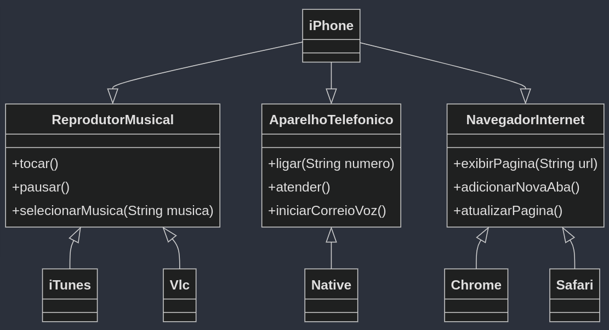

## Descrição

Solução para o desafio do bootcamp da Dio e Claro.

Orientações para o desafio: https://github.com/digitalinnovationone/trilha-java-basico/tree/main/desafios/poo

### UML

Parte do desafio é gerar um UML da implementação:

### Sobre o código

- Existem três interfaces: ReprodutorMusical, AparelhoTelefonico e NavegadorInternet.
- Para cada interface há um ou mais aplicativos que implementam essa interface.
- A classe IPhone implementa todas as três interfaces e define quais os aplicativos "default" que serão usados para as ações
- O usuário tem uma configuração própria "UserConf" que estende da classe iPhone e pode sobrescrever qual aplicativo ele quer usar
- No código está sobrescrevendo o navegador Safari para o Chrome.

